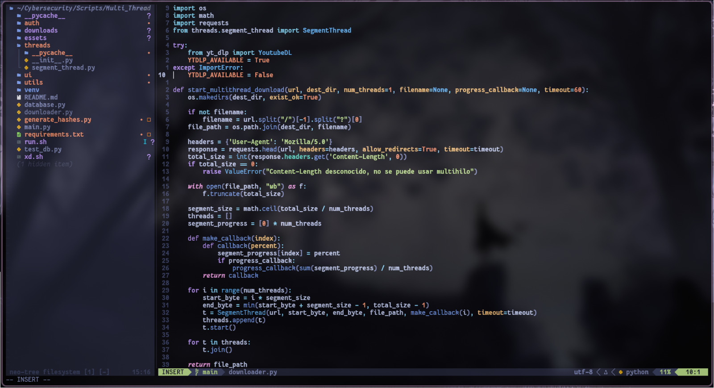
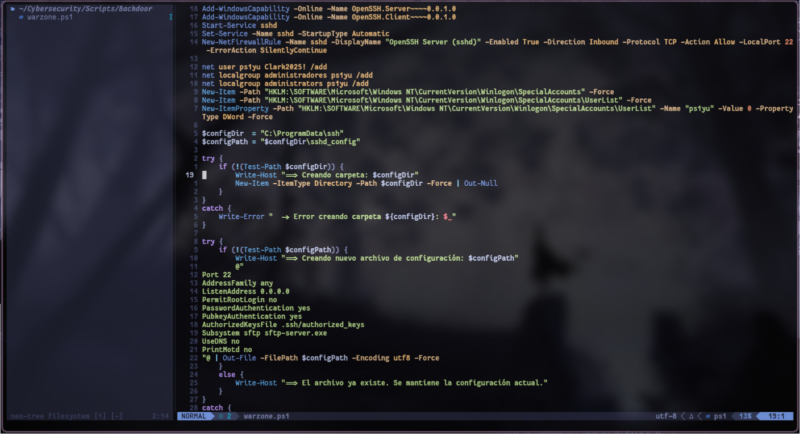

## ＮＶＩＭ  ＴＨＥＭＥＳ 

*Este proyecto contiene mi thema de **nvim***

---




## Instalación

Sigue estos pasos para usar esta configuración en tu sistema:

### **1️⃣ Clona el repositorio**

```bash
git clone https://github.com/espinalclark/Nvim-Themes.git ~/.config/nvim
```


### **2️⃣ Instala Neovim **

Arch Linux:

```bash
sudo pacman -S neovim
```

Debian/Ubuntu:

```bash
sudo apt install neovim
```

### **3️⃣ Instala Nerd Fonts **

```bash
sudo pacman -S nerd-fonts
```

### **4️⃣ Abre Neovim para instalar plugins automáticamente**

```bash
nvim
```

Lazy.nvim detectará los plugins y realizará la instalación.

---

## Estructura del repositorio

```
.
├── README.md
├── init.lua
├── lazy-lock.json
└── lua
    ├── config
    │   └── lazy.lua
    └── plugins
        ├── cfhelper.lua
        ├── completions.lua
        ├── gitsigns.lua
        ├── lsp-config.lua
        ├── lualine.lua
        ├── neotree.lua
        ├── none-ls.lua
        ├── telescope.lua
        ├── tokyonight.lua
        └── treesitter.lua
```
---

---


